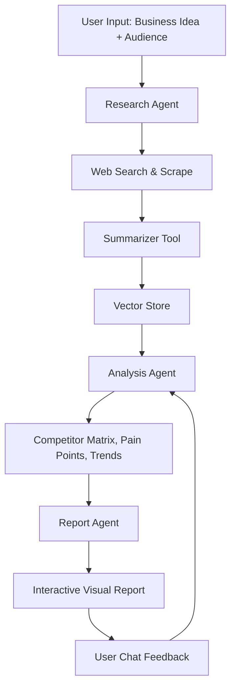

# 🤖 Market Research Agent

An intelligent agentic AI system that autonomously performs end-to-end market research for any business idea—gathering competitor data, extracting customer pain points, identifying trends, and generating actionable reports—all with minimal user input.


---

## 🚀 Key Features

✅ **Agentic AI**: Powered by OpenAI Agent SDK & LangChain to plan, reason, and act.

🔎 **Autonomous Web Research**: Scrapes competitor websites, reviews (Amazon, G2, Reddit), blogs, news, and more.

📊 **Smart Analysis**: Extracts value propositions, pricing, pain points, and emerging trends.

📄 **Beautiful Reports**: Generates structured market reports with competitor matrix, insights, and recommendations.

💬 **Chat with the Agent**: Interactively refine the report or dig deeper with natural language queries.

🧠 **Memory + Reflection**: Uses vector databases for persistent knowledge and self-critiques its own outputs.

---

## 🧠 Tech Stack

| Component         | Technology                     |
|------------------|---------------------------------|
| 🧠 Core Agent     | OpenAI Chat SDK, LangChain      |
| 🔍 Search & Scrape| Playwright, SerpAPI, BeautifulSoup |
| 🧰 Tools          | pdfplumber, tiktoken            |
| 🧠 Memory         | ChromaDB / Pinecone             |
| 🌐 UI             | Streamlit / FastAPI             |
| 🗃️ Persistence     | PostgreSQL / SQLite (optional)  |

---

## 🛠️ Architecture



---

## 📦 Installation

1. Clone the repository:
   ```
   git clone https://github.com/your-username/market-research-agent.git
   cd market-research-agent
   ```

2. Install the required dependencies:
   ```
   pip install -r requirements.txt
   ```

3. Set up environment variables by copying `.env.example` to `.env` and filling in the necessary values.

## 🚀 Usage

To run the application, execute:
```
python src/main.py
```

You can access the Streamlit UI or the FastAPI server as per your setup.

## 🧪 Testing

To run the tests, use:
```
pytest tests/
```

## 📄 License

This project is licensed under the MIT License - see the [LICENSE](LICENSE) file for details.